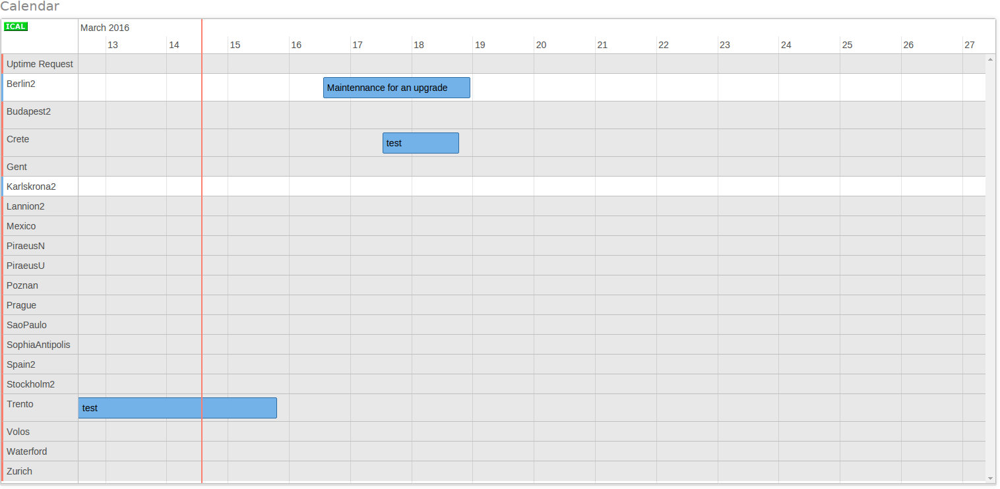

# Introduction

Calendar widget is a horizontal-based timeline, where each region is placed on a different row, plus one for no-maintennance requests. Users must have proper rights to create events on a certain row, by veing infrastructure owner or the region or by being designated as authorized for creating no-maintenance requests. Roles in grey color are not writtable by the user, whereas he does have permission to write on white ones. A regular lab user shall see all the calendar marked in grey.

# Usage

By double clicking on the specified row (whenerer user is authorized), a modal dialog appears to enter details. Textual description must be written here, but timing can be stablished back on the calendar. By clicking on an event that the user can modify, interface changes being able to delete it or, more important, drag edges to the desired values for modifying start and end date and time.

Another interesting feature is the zooming function. By clicking shift key while using the scroll, horizontal zooming happens, allowing to select the time-frame to be shown. Calendar can be also dragged horizontally to move on the current zoom level. Zooming function ranges from years to hours level.
